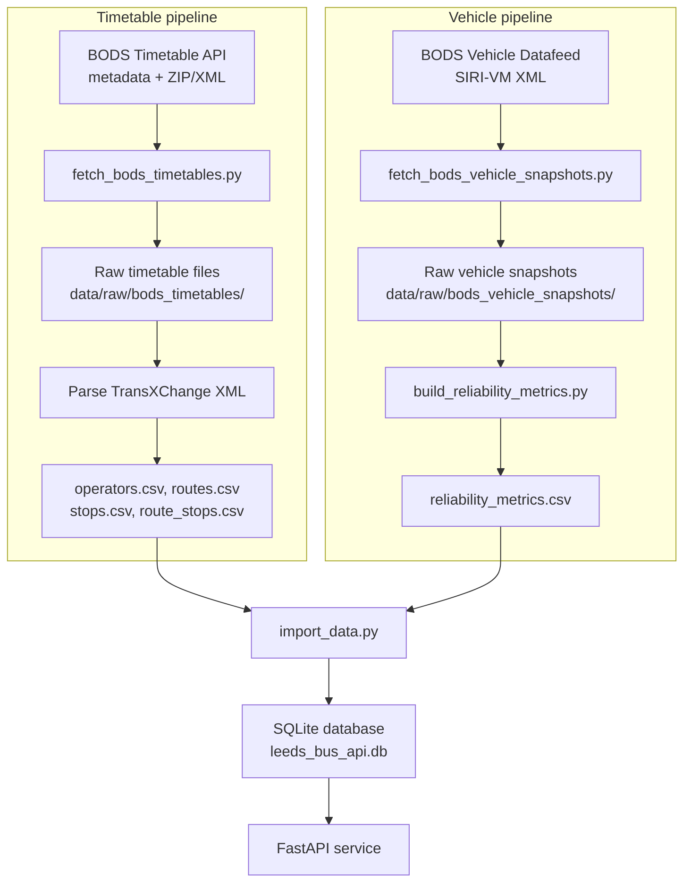

# Leeds Bus Reliability and Delay Analytics API

This project is a coursework API built with `FastAPI` and `SQLite` for analysing bus route reliability and delay patterns in `Leeds` using `BODS` as the single external data source.

## Features

- Public read-only endpoints for operators, routes, stops, incidents, and route reliability analytics
- `X-API-Key` protection for incident write operations
- Offline data preparation pipeline for importing real BODS timetable XML/ZIP files and vehicle snapshots
- SQLite-backed analytics through precomputed reliability metrics

## Fixed Endpoints

1. `GET /operators`
2. `GET /routes`
3. `GET /routes/{route_id}`
4. `GET /stops`
5. `POST /incidents`
6. `GET /incidents`
7. `GET /incidents/{incident_id}`
8. `PUT /incidents/{incident_id}`
9. `DELETE /incidents/{incident_id}`
10. `GET /analytics/routes/{route_id}/reliability`

## Project Structure

```text
app/
  core/          Settings and security helpers
  db/            SQLAlchemy base and session setup
  models/        ORM models
  schemas/       Pydantic request and response models
  routers/       FastAPI routers
  services/      Business logic for incidents and analytics
  dependencies/  Shared request dependencies
scripts/         Data fetch, transform, and import scripts
tests/           Pytest test suite
data/            Raw and processed input files
docs/            Scope, API, and data design documents
```

## Setup

1. Create a virtual environment.
2. Install dependencies:

```bash
pip install -r requirements.txt
```

3. Configure environment variables in `.env`:

```env
DATABASE_URL=sqlite:///./leeds_bus_api.db
WRITE_API_KEY=change-me
BODS_API_KEY=your-bods-key
```

4. Start the API:

```bash
uvicorn app.main:app --reload
```

5. Open the generated docs at:

- `http://127.0.0.1:8000/docs`

## Data Pipeline



1. Fetch Leeds timetable metadata and files from BODS
2. Parse `TransXChange` timetable files into `operators`, `routes`, `stops`, and `route_stops`
3. Fetch BODS vehicle location snapshots for a fixed time window
4. Parse `SIRI-VM` vehicle snapshots into route-level reliability metrics
5. Import processed CSV files into SQLite
6. Start the API and use the incident endpoints to create demo records if needed

Example commands:

```bash
python scripts/fetch_bods_timetables.py
python scripts/fetch_bods_vehicle_snapshots.py
python scripts/build_reliability_metrics.py
python scripts/import_data.py
```

Notes:

- `fetch_bods_timetables.py` downloads real BODS timetable dataset files and extracts route and stop records from `TransXChange` XML
- `fetch_bods_vehicle_snapshots.py` stores raw vehicle snapshot responses, typically `SIRI-VM` XML
- `build_reliability_metrics.py` maps parsed vehicle activities to imported routes and computes aggregated reliability metrics

## API Authentication

- `GET` endpoints are public
- `POST`, `PUT`, and `DELETE` incident endpoints require the `X-API-Key` header

Example:

```http
X-API-Key: change-me
```

## Documentation

- **API Documentation (PDF):** [docs/api-documentation.pdf](docs/api-documentation.pdf) — all endpoints, parameters, response formats, example requests/responses (JSON), authentication, and error codes.  
- **Swagger UI (interactive):** When the API is running, open [http://127.0.0.1:8000/docs](http://127.0.0.1:8000/docs) for try-it-out API docs; [http://127.0.0.1:8000/redoc](http://127.0.0.1:8000/redoc) for ReDoc.
- Scope and implementation decisions: `docs/project-scope.md`
- Data sources: `docs/data-sources.md`
- Data dictionary: `docs/data-dictionary.md`

## Testing

Run the test suite with:

```bash
pytest
```
